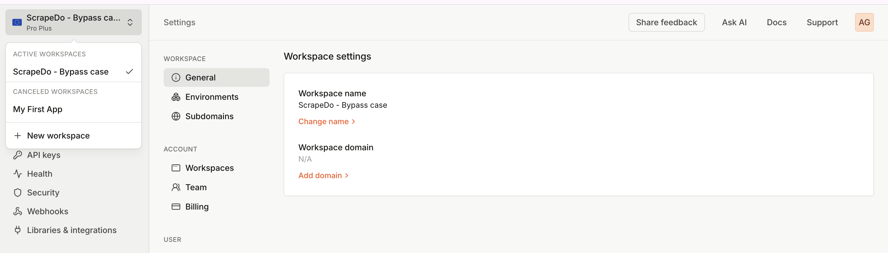

# TLSGhost 🔥

**Advanced TLS Fingerprinting & Browser Automation Toolkit**

> **Project Context**: This project was developed as part of a technical interview preparation for [ScrapeDo](https://scrapedo.com), a leading web scraping platform. It demonstrates advanced anti-detection techniques and TLS fingerprinting capabilities that are essential for modern web scraping operations.

TLSGhost is a powerful Go-based toolkit designed for TLS fingerprinting analysis, browser automation, and detection bypass techniques. It provides comprehensive tools for understanding and manipulating TLS client fingerprints, HTTP/2 signatures, and browser automation with stealth capabilities - perfect for web scraping scenarios where anti-bot detection is a challenge.


## 🌟 Features

- **TLS Fingerprinting Analysis** - Extract and analyze TLS client fingerprints
- **HTTP/2 Signature Detection** - Identify HTTP/2 client signatures across different browsers
- **Browser Automation** - Stealth browser automation with detection bypass
- **JA3/JA4 Support** - Full support for JA3 and JA4 fingerprinting methods
- **Akamai Bypass** - Tools for analyzing and bypassing Akamai's fingerprinting
- **Proxy Integration** - Custom proxy with TLS fingerprint spoofing
- **Multiple Test Cases** - Comprehensive test scenarios for different platforms
- **Web Scraping Ready** - Designed for real-world scraping challenges

## 🎯 Why This Matters for Web Scraping

Modern websites use sophisticated detection methods to identify and block automated requests:

- **TLS Fingerprinting**: Websites can identify bots by analyzing TLS handshake patterns
- **HTTP/2 Fingerprinting**: Browser-specific HTTP/2 settings can reveal automation
- **Browser Fingerprinting**: JavaScript-based detection of browser inconsistencies
- **Akamai Protection**: Many sites use Akamai's bot detection system

TLSGhost addresses these challenges by providing tools to:
- ✅ Analyze and replicate real browser TLS fingerprints
- ✅ Bypass Akamai and similar protection systems
- ✅ Maintain consistent browser signatures across requests
- ✅ Automate browsers while appearing human-like

## 📊 TLS Fingerprinting Examples

### JA3 Fingerprint Simulation: Verified!

Below is a verification of the JA3 fingerprint spoofing implemented in this project.

On the **left**, you can see the original JA3 fingerprint generated by a real browser (Chrome 137) on [tls.browserleaks.com](https://tls.browserleaks.com) or [peet.ws](https://tls.peet.ws).  
On the **right**, the exact same JA3 fingerprint is reproduced by the custom Go-based proxy client using [tls-client](github.com/bogdanfinn/tls-client)  and a manually constructed TLS spec.

This proves that the TLS handshake (ClientHello) generated by the Go client **perfectly mimics the browser**, down to cipher suites, extensions, and curve order – resulting in an identical JA3 hash.

### 🔬 Why is this important?

JA3 hashes are used by advanced anti-bot and fingerprinting systems (like Akamai, Cloudflare, and Imperva) to detect non-human traffic.  
By replicating a real browser's JA3 fingerprint, we can **bypass such detection mechanisms** and make scraping or automation tasks appear indistinguishable from genuine users.


| Real Browser Fingerprint (Chrome 137)          | Simulated Go Client Fingerprint |
|------------------------------------------------|---------------------------------|
|  |     |


### Network Packet Analysis

Using Wireshark integration for detailed TLS handshake analysis:


*Detailed TLS Client Hello packet analysis with SNI=tls.peet.ws, showing TLS 1.2 version and various extensions*

### JA3 Fingerprint Analysis

Python-based JA3 hash analysis and parsing in IPython console:


*IPython console showing JA3 hash parsing with split components and cipher suite analysis*

### Code Implementation

Go-based TLS extension definitions and constants in code editor:


*Go code editor showing TLS extension constants like ExtensionECH, ExtensionRenegotiationInfo, etc.*

### JSON Fingerprint Data

Real fingerprint data in JSON format with complete JA3/JA4 information:


*Complete fingerprint data in JSON format including JA3, JA4, and Akamai hashes*

### Fingerprint.com Premium Organization (ScrapeDo-Bypass) 



## 🚀 Quick Start

### Prerequisites

- Go 1.24.1 or higher
- Chrome/Chromium browser (for automation features)

### Installation

```bash
git clone https://github.com/orangehaired/TLSGhost.git
cd TLSGhost
go mod download
```

### Basic Usage

#### 1. Akamai Fingerprint Analysis

```bash
make run-akamai
```

This will analyze your TLS fingerprint and compare it with known browser signatures.

#### 2. Browser Automation Test

```bash
make run-sannysoft
```

Runs stealth browser automation against bot detection tests.

#### 3. Proxy with Custom Fingerprint

```bash
# Start the proxy server
make run-proxy

# In another terminal, test with custom JA3
make run-proxy-client
```

## 📁 Project Structure

```
TLSGhost/
├── ghostbrowser/           # Core browser automation
│   ├── akamai/            # Akamai fingerprinting tools
│   ├── sannysoft/         # Browser automation tests
│   └── browser.go         # Browser context creation
├── testcases/             # Test scenarios
│   ├── akamai/           # Akamai fingerprint tests
│   ├── sannysoft/        # Browser automation tests
│   ├── fingerprintdotcom/ # Fingerprint.com integration
│   └── ghostproxy/       # Proxy server implementation
├── images/                # Documentation images
├── go.mod                 # Go module dependencies
├── Makefile              # Build and run commands
└── README.md             # This file
```

## 🔧 Available Commands

| Command | Description |
|---------|-------------|
| `make run-akamai` | Run Akamai fingerprint analysis |
| `make run-sannysoft` | Run browser automation tests |
| `make run-fingerprintdotcom` | Run fingerprint.com tests |
| `make run-proxy` | Start proxy server |
| `make run-proxy-client` | Test proxy client |

## 🛠️ Core Components

### 1. Akamai Fingerprinting

The `ghostbrowser/akamai` package provides tools for:

- HTTP/2 fingerprint extraction
- Akamai-style hash generation
- TLS connection analysis
- Browser signature comparison

```go
fp, err := akamai.FingerprintFromConn("tls.peet.ws:443", "tls.peet.ws")
fingerprint, hash := fp.AkamaiHash()
```

### 2. Browser Automation

The `ghostbrowser` package provides stealth browser automation:

- Chrome/Chromium automation
- Detection bypass techniques
- Screenshot capture
- JavaScript injection

### 3. Proxy Server

The proxy server allows custom TLS fingerprinting:

- JA3 hash spoofing
- Custom User-Agent injection
- HTTP/2 settings manipulation
- Real-time fingerprint modification


## 🔍 Use Cases

### 1. Security Research
- Analyze TLS fingerprinting techniques
- Understand browser detection methods
- Research anti-bot systems

### 2. Web Scraping
- Bypass fingerprint-based blocking
- Maintain consistent browser signatures
- Avoid detection systems

### 3. Testing & Development
- Test web applications against different fingerprints
- Validate security measures
- Develop fingerprint-resistant applications

## 🎯 ScrapeDo Interview Context

This project demonstrates advanced understanding of:

- **Anti-Detection Techniques**: TLS fingerprinting, HTTP/2 signatures, browser automation
- **Web Scraping Challenges**: Modern websites use sophisticated bot detection
- **Technical Implementation**: Go-based solution with real-world applicability
- **Problem-Solving**: Addressing specific challenges in web scraping industry

The project showcases skills relevant to ScrapeDo's mission of providing reliable web scraping solutions in an increasingly protected web environment.

*Developed as part of ScrapeDo technical interview preparation*